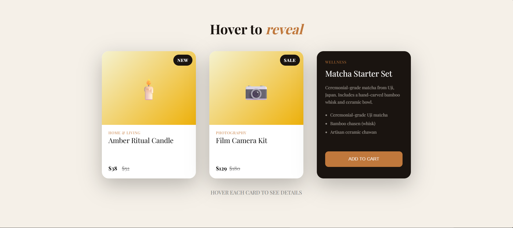

# 3D Card flip project

Project was designed to design complex animations while maintianing UI, Accessibility and good HTML semantics.

## Technologies used:
- HTML
- CSS
- Git/GitHub

## Techniques

- HTML Semantics
- Accessibility Aria
- Animations
- Flex box
- hover
- perspective
- transform-style
- back-face-visibility 

## How to view

open the index.html file.

## Screenshots

